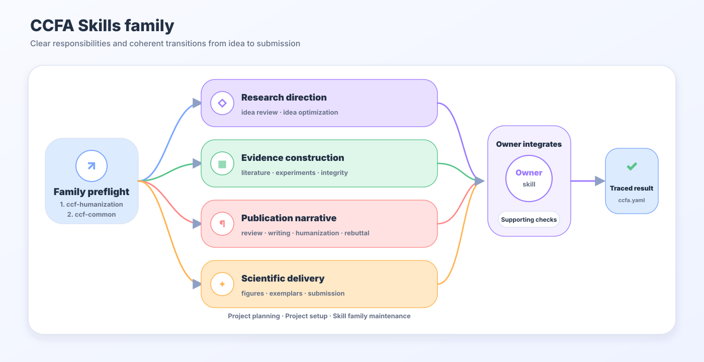

# CCFA Architecture

CCFA is a paper-project workflow family, not a loose collection of unrelated writing prompts. The current 17-skill architecture has one owner per responsibility area, a first-priority humanization overlay, and `ccfa.yaml` plus explicit artifact contracts to keep stages connected.



## Core Model

The family has four layers:

| Layer | Purpose | Skills |
| --- | --- | --- |
| Priority humanization overlay | Keep publication prose direct and evidence-faithful alongside its content owner; remove empty defenses and retain meaningful uncertainty. | `ccf-humanization` |
| Research production chain | Move a paper project from project setup to rebuttal. | `ccf-project-scaffolder`, `ccf-pipeline-orchestrator`, `ccf-idea-optimizer`, `ccf-idea-reviewer`, `ccf-literature-monitor`, `ccf-literature-searcher`, `ccf-experiment-designer`, `ccf-visual-composer`, `ccf-paper-to-exemplar`, `ccf-paper-writer`, `ccf-paper-reviewer`, `ccf-integrity-auditor`, `ccf-submission-checker`, `ccf-rebuttal-writer` |
| Shared state and policy | Keep routing, evidence, privacy, source registry, and artifact ownership consistent. | `ccf-common` |
| Family maintenance | Maintain skills, docs, generated SVGs, validation, and releases. | `ccf-skill-forger` |

Stages are composed around requested outputs, rather than run as a fixed chain. Typical paths include:

```text
idea assessment + development: review idea -> optimize idea
writing with a missing citation: writer -> bounded search -> writer
review + revision: reviewer -> writer -> affected checks
existing figure update: visual composer -> affected exports

Humanization runs within a publication-prose stage.
Scaffolding, orchestration, monitoring, exemplars, and submission checks
are selected when requested or necessary for a concrete deliverable.
```

Rebuttal owns response structure and ledger discipline; requested manuscript edits belong to `ccf-paper-writer`. Bounded helpers return to the current owner with verified results and paths. Do not cycle among owners without new input or an unresolved action; finish when the requested deliverables and applicable checks are complete.

## Working Files And Incremental Execution

The file contract is the first instruction section in every runtime skill. Preserve explicit paths, existing project mappings, and established folders. When none exist, generated working files use `output/ccfa-workfiles/<purpose>/<artifact-id>/`, such as `figures/method-overview/` or `reviews/paper-short-title/` beneath that root. Create source/assets/cache/build subdirectories only as needed. Names describe the task and content; the same artifact keeps its directory across skill transitions. Ordinary updates replace the current generated file, while raw observations, required comparison baselines, submitted packages, and requested history remain evidence. Clean only verified disposable files created by the task.

An existing editable figure is updated from its authoring source and only affected requested formats are re-exported. A single current specification holds scientific labels, topology, layout, asset provenance, and useful QA state. Local changes do not require a new concept image or duplicate manifests. Failed exports remain explicitly incomplete while the last usable artifact is preserved.

Reference loading follows the current mode. Reuse verified sources and extracted text when still applicable; send scope, source versions/anchors, paths, edit ownership, and the exact next action across handoffs. A helper returns to the requesting owner without a new intake form or report by default. Complete assessments retain their required evidence coverage. Shared execution rules live in `ccf-common/references/task-modes.md`, the continuity/return contract in `ccf-common/references/handoff-modes.md`, and file lifetimes/placement in `ccf-common/references/artifact-contracts.md`.

## Artifact State

`ccfa.yaml` records the project state:

- `version`
- `project`
- `target_venue`
- `stage`
- `artifacts`
- `claims`
- `experiments`
- `reviews`
- `revision_ledger`
- `submission_checks`

The file is not meant to contain the whole paper. It is a routing and status spine. Concrete outputs still live in manuscript, review, evidence, experiment, submission, artifact, and rebuttal files.


## Owner Boundaries

The family intentionally merged helper skills into owner modes. `ccf-visual-composer` carries a small self-contained Python SVG plotting recipe library for reproducible data figures and an architecture-diagram workflow: content-derived prompt, authorized image generation, draft inspection, and semantic SVG/vector-PDF reconstruction when requested. Existing authorization covers the required stages; optional extra formats remain optional.

| Capability | Owner | Boundary |
| --- | --- | --- |
| Humanization and publication-faithfulness | `ccf-humanization` | Runs alongside publication writing; removes rhetorical defenses, preserves scientific facts, and raises only concrete unresolved decisions. Raw plans and assessment-only work do not load it by default. |
| Workflow planning | `ccf-pipeline-orchestrator` | Coordinates stages; does not write, search, review, or rebut. |
| Literature monitoring | `ccf-literature-monitor` | Tracks recent papers, venue feeds, labs, and competitors; deep retrieval stays with literature search. |
| Compression and presentations | `ccf-paper-writer` | Changes manuscript-derived text; does not judge acceptance risk. |
| Exemplar extraction | `ccf-paper-to-exemplar` | Converts PDFs into writing pattern cards; does not draft or review manuscripts. |
| Writing review | `ccf-paper-reviewer` | Diagnoses writing and format-facing risk; does not rewrite unless handed back to writer. |
| Citation audit | `ccf-integrity-auditor` | Checks existing citations; broad discovery stays with literature search. |
| Result evidence and specs | `ccf-experiment-designer` | Uses real results; never invents numbers. |
| Publication visuals | `ccf-visual-composer` | Owns reproducible data plots plus research method/architecture diagrams, GPT Image 2-first generation, post-generation editable SVG/PDF/PPTX reconstruction, explicit pure-SVG opt-out, palettes, captions, manuscript integration, and render QA. |
| Venue format and artifacts | `ccf-submission-checker` | Checks package readiness; content polishing stays with writer. |
| Resubmission adaptation | `ccf-rebuttal-writer` | Maintains response/ledger logic; manuscript edits route back to writer. |
| Docs SVGs | `ccf-skill-forger` | Repository maintenance only; research figures/tables stay with experiment designer and visual composer. |


## Venue Branch

Venue-specific LaTeX and policy notes are reference material:

```text
ccf-paper-writer/references/venue-guides/index.md
ccf-paper-writer/references/venue-guides/<venue>.md
```

Use `ccf-paper-writer` for venue-aware manuscript text and page-budget-aware drafting. Use `ccf-submission-checker` for final page limits, anonymity, PDF metadata, camera-ready checks, and package readiness. If a from-scratch writing request names a venue, writer reads the venue guide and length budget first; if no venue is named or the guide is missing, writer falls back to the NeurIPS template. Writer expands substantive omissions and compresses overlength drafts before final submission checks; page fill alone does not justify padding or repeated compile loops.

## Source Of Truth

`SKILL.md` is authoritative for runtime behavior. These files are public indexes and audit aids:

- [SKILLS_CATALOG.md](SKILLS_CATALOG.md)
- [NAMING_AND_MERGE_AUDIT.md](NAMING_AND_MERGE_AUDIT.md)
- `ccf-common/references/routing.md`
- `ccf-common/references/skill-trigger-registry.yaml`
- `ccf-common/references/artifact-contracts.md`
